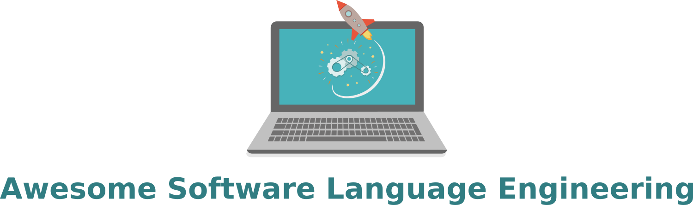

 

> SLE is defined as the application of systematic, disciplined, and measurable approaches to the development, deployment, use, and maintenance of software languages — [SLEBoK (Software Language Engineering Body of Knowledge)](https://slebok.github.io/)

This is a collection of software language engineering (SLE) tools, frameworks and books. Pull requests are very welcome!  

## License

To the extent possible under law, [Manuel Leduc](///mleduc.xyz) has waived all copyright and related or neighboring rights to this work.
Title image [Designed by Freepik](http://www.freepik.com).
